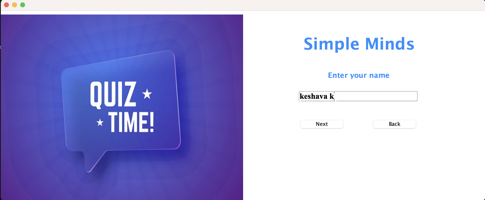
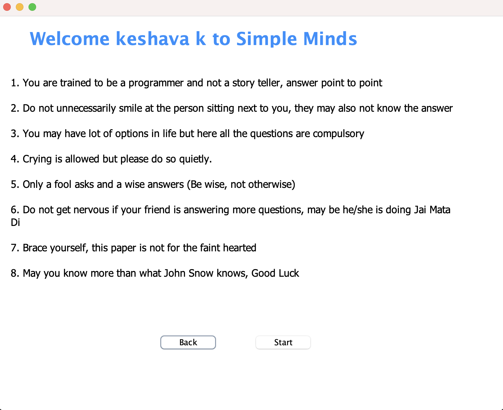
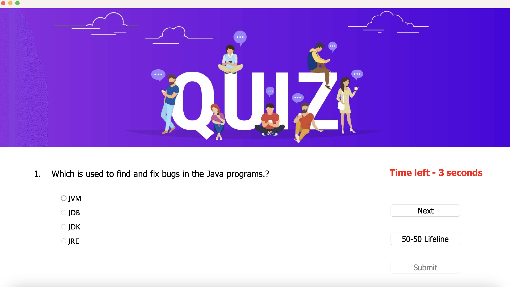
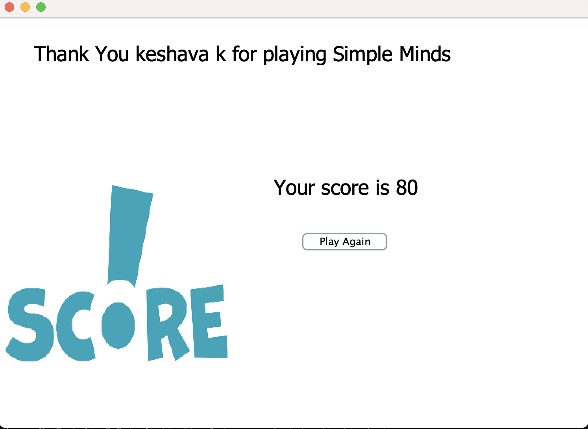

# 🎯 Quiz Application

Welcome to the **Quiz Application** – a simple, console-based Java program built for interactive multiple-choice quizzes. It’s perfect for learning, testing knowledge, or even creating fun trivia challenges among friends.

---

## 📸 Preview

### 🖼️ Main Menu

---

## 🚀 Features

- 🧠 Multiple-choice questions
- ⏱️ Real-time quiz flow (can be extended with timers)
- 📊 Score calculation and instant feedback
- 🖥️ Console-based UI – lightweight and clean
- 🛠️ Easy to extend with more questions/topics

---

## 🧠 How It Works

1. User launches the app.
2. Main menu is displayed with options to start the quiz.
3. Each question is displayed with 4 options.
4. User selects an option using the keyboard.
5. After completing all questions, the score is displayed.
6. Optionally, correct answers can be shown for review.

---

### 🖼️ Sample Quiz Screen

---

# Question's screen

---

# Score's screen

## 🛠️ Technologies Used

- **Java** – Core language for logic and user interface (console-based)
- **OOP** – Clean, modular code using object-oriented principles

---

## ⚙️ How to Run

> 📌 Make sure you have Java installed and added to your system's PATH.

# first command

> javac src/quiz/application/*.java

# second command

>java -cp src quiz.application.Login

# 📜 License
MIT License – feel free to use, modify, and distribute for educational or personal use.

# ❤️ Support
If you found this useful or cool:

🌟 Star this repo

🍴 Fork it and add your own questions/features

🗣️ Share with friends and let the quiz wars begin!
